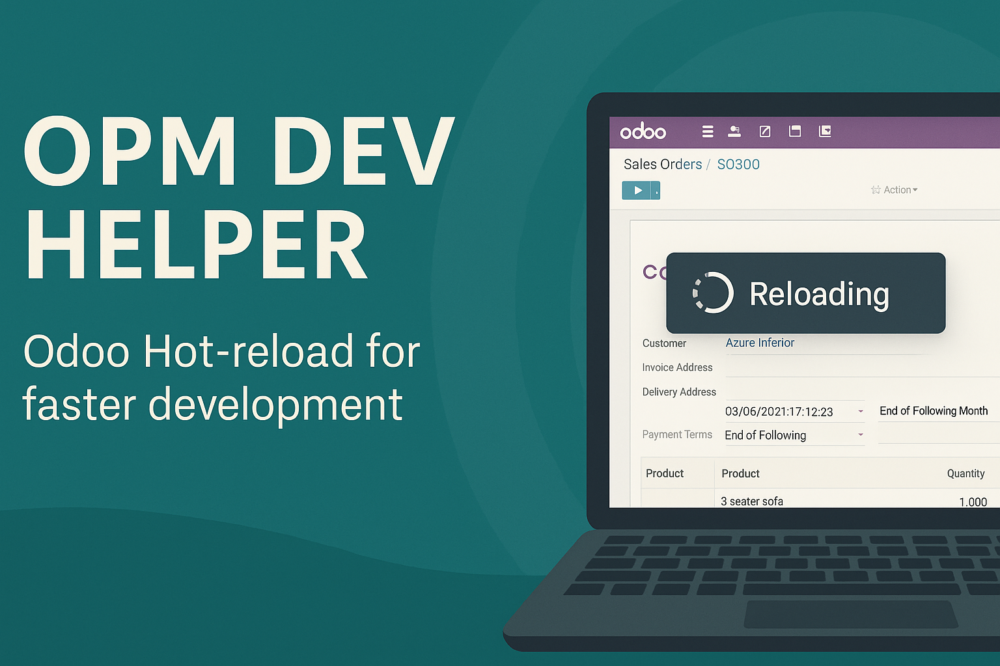

# OPM Dev Helper

A lightweight developer utility module designed to enhance your Odoo development workflow.

**OPM Dev Helper** integrates seamlessly with the [Odoo Plugin Manager (CLI)](https://github.com/ahmetatakan/odoo-plugin-manager)  
to provide live-reload capabilities, instant cache flushing, and fast module upgrades — all without restarting your Odoo server.

---

## 🚀 Features

- 🔁 **Live Reload Integration** — automatically reloads your browser when XML, JS, or SCSS files change.  
- ⚡ **Quick Module Upgrade** — rebuild and upgrade individual modules instantly using OPM CLI.  
- 🧹 **Cache Flush Tools** — safely clears Odoo’s view and QWeb caches for faster UI iteration.  
- 🌐 **WebSocket Integration** — works with `opm dev` for real-time reload signals across multiple browsers.  

---

## 🧩 Requirements

- Odoo **15.0**, **16.0**, or **17.0**  
- [Odoo Plugin Manager (CLI)](https://github.com/ahmetatakan/odoo-plugin-manager)

> ⚠️ This module **requires** Odoo Plugin Manager (CLI).  
> It will not function as a standalone module.
